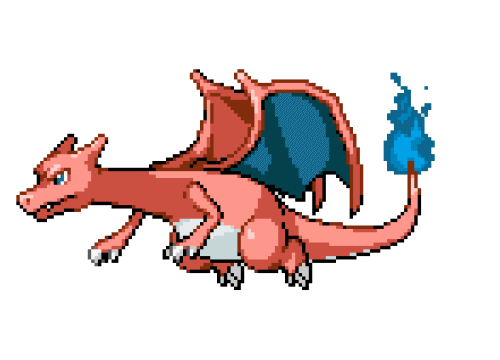

<section class="head">

    

        

            Pokeshots
        

    

    Um jogo de adivinhação no universo Pokémon!

    

</section>

<section class="main" style="color: #2b2b2b;">
    

        O Desafio!
    

     

    Imagina um mundo onde os desafios não são apenas batalhas de ginásio, mas também de advinhação! Em PokéShots, o objetivo é simples: acertar o Pokémon secreto em poucas tentativas, testando sua memória, estratégia e paixão pelo universo Pokémon.

    Estratégia e Evolução!

 

    Gostamos de Pokémon e achamos que seria divertido criar um jogo onde a gente descobre qual é o Pokémon, baseando-se nas características dele. Além disso, o jogo também ajuda aos fãs a conhecerem um pouco mais sobre esses tão amados monstrinhos de bolso.

    Mais que um jogo!

 

    PokéShots não é só diversão, ele também nasceu de uma ideia acadêmica, colocando em prática o que aprendemos nas "quests" da sala de aula. Cada partida é como um treino, a gente evolui, aplica conhecimento e cria algo que gera impacto positivo na comunidade. Esperamos que PokéShots traga diversão e conhecimento para você e agradecemos seu acesso. Bom jogo!

</section>

<section class="about" style="color: #fff;">

---

    Sobre o Jogo

O jogo foi desenvolvido em HTML, CSS, JS e Java com Spring Boot. 

 

    Se trata de um jogo de adivinhar qual o Pokémon do dia. Você digita o Pokémon e ele vai te retornar se está certo ou errado, passando quais parâmetros estão certos e quais estão errados. Baseado nisso, conforme você vai juntando as características dos Pokémon que errou, fica mais fácil adivinhar qual seria o do dia.

O que vem por aí:

    - 🌑 **Modo Sombra:** Tente acertar o Pokémon apenas pela sua silhueta!
    - 🃏 **Modo Carta:** Adivinhe baseado na carta oficial do Pokémon.
    - 📖 **Pokédex Pessoal:** Um local no jogo que servirá como uma Pokédex, mostrando todos os Pokémon que você já acertou.

---

    CONTROLES:

 

    <table style="width: 100%; border-collapse: collapse; text-align: left;">
        <thead>
            <tr>
                <th style="border-bottom: 2px solid #a3a3a3; padding: 10px;">Tecla / Ação</th>
                <th style="border-bottom: 2px solid #a3a3a3; padding: 10px;">Função</th>
            </tr>
        </thead>
        <tbody>
            <tr>
                <td style="border-bottom: 1px solid #555555; padding: 10px;"><strong>Teclado</strong></td>
                <td style="border-bottom: 1px solid #555555; padding: 10px;">Digitar o nome do Pokémon para o palpite.</td>
            </tr>
            <tr>
                <td style="border-bottom: 1px solid #555555; padding: 10px;"><strong>Mouse / Enter</strong></td>
                <td style="border-bottom: 1px solid #555555; padding: 10px;">Confirmar o palpite e visualizar as dicas na tela.</td>
            </tr>
        </tbody>
    </table>

</section>
<section class="footer">

---

    Mais Informações

 

    

        
Atualizado

        
⏱️ Em desenvolvimento

        
Plataformas

        
Web (Navegador)

        
Integrantes

        
Igor Hernandes, Matheus L Ferreira, Daniel Nunes Becaria

        
Gênero

        

            Puzzle, 
            Trivia, 
            Adivinhação
        

        
Feito com

        

            HTML, 
            CSS, 
            JavaScript, 
            Java (Spring Boot)
        

        
Motivo

        
Projeto de extensão curricular desenvolvido com a professora Tania.

        
Tags

        

            pokemon, 
            guess, 
            wordle-like, 
            web-game, 
            fangame, 
            spring-boot
        

    

</section>